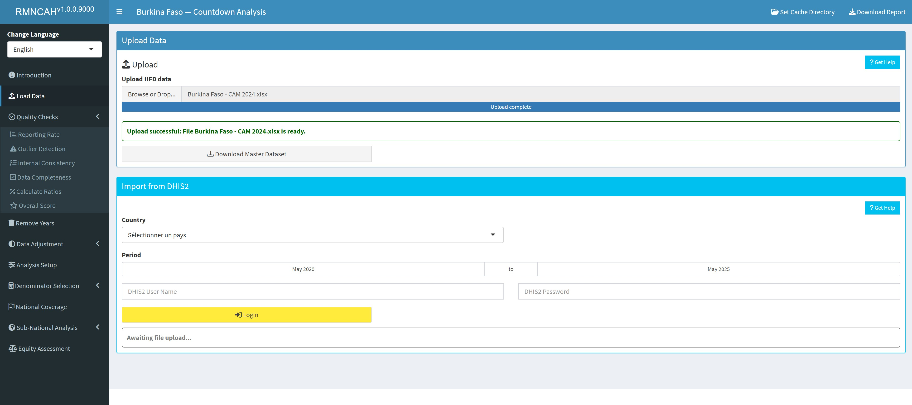

<!-- README.md is generated from README.Rmd. Please edit that file -->

# cd2030.rmncah

<!-- badges: start -->

<!-- badges: end -->

## Introduction

This is a web app for analysing health facility data from the DHIS 2 database using the Countdown 2030 analytical approach.
The app also integrates analysis using the household surveys (DHS, MICS)
It’s also an R package, so you can use some features in the code
directly.

## Features

- Data quality assessment.
- Countdown 2030 analytical approach.
- Routine facility and survey data analysis integration
- Use as an R package for programmatic access.
- Interactive visualizations for quick insights.

## Installation

<!--
You can install a stable version of cd2030 app from [GitHub](https://github.com/) with:
&#10;
``` r
devtools::install_github("aphrcwaro/cd2030.rmncah@v1.0.0")
```
-->

## Development version

To get a bug fix or to use a feature from the development version, you
can install the development version of cd2030 app.

``` r
devtools::install_github("aphrcwaro/cd2030.rmncah")
```

## Running the App

Start the web dashboard:

``` r
library(cd2030.rmncah)
dashboard()
```

## Example Usage

Analyze DHIS 2 data programmatically:

``` r
data <- load_excel_data("/path/to/hfd/data.xlsx")
calculate_average_reporting_rate(data)
```

## Dashboard Preview

Here is a preview of the dashboard:

<figure>

<figcaption aria-hidden="true">Dashboard Screenshot</figcaption>
</figure>

## Getting help

If you encounter a clear bug, please file an issue with a minimal
reproducible example on
.

## Contributing

Contributions to improve the **cd2030.rmncah** package are welcome!
Please fork the repository, make your changes, and submit a pull
request.
